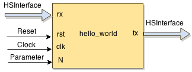

`pyhdf` promotes a test-driven design approach; It facilitates to a great extent the creation and execution of
design module unit tests. Below, we give details about the features and the usage of the testing facilities of `pyhdf`.
{.lead}

To ease the discussion, assume a simple `hello_world` module design, which has one input and one output interface (HSD type),
reset and clock inputs, and one parameter (generic):



__It is important to note that the unit testing of `pyhdf` abstracts low-level details such as `reset` and `clock` manipulation, and data synchronization with these signals. As a result, the designer can focus more on the purpose of the test by determining input stimuli and expected results (reference data).__{.lead}

Module files and directory structure
====================================

Starting from a `hello_world.json` specification file of the module, an empty unit test template is automatically created when running command __new__.

```.bash
$ module hello_world new
```

For our `hello_world` example design, the command will generate the following files and directories:

```
└── hello_world
    ├── hello_world.json
    ├── hello_world.py
    ├── __init__.py
    ├── out
    ├── src
    │   ├── compile_list.txt
    │   ├── hello_world_beh.py
    │   ├── hello_world_rtl.py
    │   └── __init__.py
    └── test
        ├── hello_world.gtkw
        ├── hello_world_cosim.gtkw
        ├── __init__.py
        ├── t_hello_world.py
        ├── utest_hello_world.py
        └── vectors
```

The module directory structure is discussed in [dir_struct]. Here, we focus only on directory `test`, which contains all the files related to testing:

* The `hello_world.gtkw` and `hello_world_cosim.gtkw` files are used to visualize the wave forms (timing diagrams) stored in corresponding `.vcd` files (using __GTKWave__).
  If traces are enabled (see below), the .vcd files are generated by the simulator as a result of running a test.

* The file `t_hello_world.py` serves as a base test class, which contains information about the input and output interfaces of module `hello_world`,
  as well as some additional info/classes.

* The file `utest_hello_world.py` contains all user-defined tests. Initially, it contains only one empty test. The designer has to fill the test body and,
  of course, to add other tests as well. __This file is the only place, where the designer has to add code with regards to module testing__.

* `vectors` is a directory used to store files containing stimuli vectors or generated results. Providing stimuli from file is an alternative way to
  feed the module under test with data.

Unit test structure
===================

In this section, we focus on file `utest_hello_world.py` and discuss the structure of a unit test. As an example, we consider a `hello_world` design,
which has one input and one output interfaces (in addition to _clk_ and _reset_). After running command __new__, the generated `utest_hello_world.py`
file looks like this:

```.python
 import unittest
 from mylib import *
 from t_hello_world import t_hello_world

 class Test_hello_world(t_hello_world):
     '''|
     | The main class for unit-testing. Add your tests here.
     |________'''
     def __init__(self):
         # Call base class constructor
         t_hello_world.__init__(self)

     # Automatically executed BEFORE every TestCase
     def setUp(self):
         t_hello_world.setUp(self)

     # Automatically executed AFTER every TestCase
     def tearDown(self):
         t_hello_world.tearDown(self)

     # @unittest.skip("")
     def test_000(self):
         """ >>>>>> TEST_000: TO DO: describe the test """

         self.models    = {"top":self.BEH}
         self.tb_params = {"N":10}
         self.tb_config = {"simulation_time":"auto",
                           "cosimulation":False,
                           "trace":False,
                           "fdump":False,
                           "ipgi":1,
                           "ipgo":1}

         # TODO: generate stimuli and reference data here

         self.run_it()
```

In this file, there is one empty test (`test_000`) generated. In every test, some configuration and module under test parameter values have to be set.
In addition, the test has to provide stimuli for each input interface, and to provide reference data (expected result) for each output interface.
Then, the test runs a simulation of the module under test using the provided stimuli and for each output interface, captures generated results.

Consequently, the structure of a test can be summarized as follows:

Test header
-----------

This includes the first 3 lines of the test. The test can be disabled by un-commenting the line at the beginning of the test:
```.python
# @unittest.skip("")
```

Also, there is a string which is printed before executing the test. It is used for describing the test:
```.python
""" >>>>>> TEST_000: TODO: describe the test """"
```

The description has to be filled by the designer of the test.

Test configuration
------------------

Configuring the test is done by assigning values to the `models`, `tb_params`, and `tb_config` maps.

* __models:__ specifies the implementation model to be used during the test. The format is a map __{"module":model}__. There are 3 supported implementation models encoded in the following constants:

Constant      | Model
------------- | -----------------
__self.BEH__  | _Behaviour_, specified in pure __Python__
__self.RTL__  | _Register Transfer Level (RTL)_, specified in convertible __MyHDL__ (Python)
__self.VRLG__ | Third-party module written in RTL __Verilog__

   Using the keyword `"top"` as module specifies the top-level implementation model. In case of structured designs, individual sub-modules may have
   different implementations used in different tests. For example, if our `hello_world` module contains 2 sub-modules named `hello1` and `world1`,
   then specifying the implementation models can be done as follows:

```.python
""" 'hello_world', behaviour model """
self.models = {"top":self.BEH}
```
```.python
""" 'hello_world', 'hello1', and 'world1', RTL model """
self.models = {"top":self.RTL}
```
```.python
""" 'hello_world' and 'hello1' - RTL model, 'world1' - BEH model """
self.models = {"top":self.RTL, "hello1":self.RTL, "world1":self.BEH}
```


* __tb_params__: If a module contains (static) parameters, for each test, parameter values have to be provided. The format is a map __{"parameter name":value}__. That is, if our `hello_world` example module has one parameter `N`, assigning value `10` to it in the test is done as follows:

```.python
self.tb_params = {"N":10}
```

* __tb_config:__ The test has the following attributes that need to be configured before running a test:

Attribute           | Description
------------------- | ----------------
__simulation_time__ | The simulator runs for the specified number of clock cycles. If set to `auto`, the simulation time is determined by the length of the input stimuli and expected results.
__cosimulation__    | If set to `False`, the MyHDL simulator will be used. If set to `True`, the module under test is first converted to verilog, then the `icarus iverilog` simulator is used. That is, the python test is run together with the verilog simulation.
__trace__           | Enable/disable `.vcd` trace generation. If set to `True`, the corresponding .vcd file is stored in directory `out`.
__fdump__           | If set to `True`, the input stimuli data and the generated results are stored to files in directory `test/vectors`. The files have the name of the corresponding interfaces and extension `.tvr`
__ipgi__            | Inter-packet gap of the input stimuli. This option specifies the number of clock cycles between input stimuli. It can be 0 or greater than 0. In case of streaming interfaces (`STAvln`), a data packet is driven to the module without any gaps and the value of `ipgi` specifies the gap between the packets.
__ipgo__            | Inter-packet gap of collecting results. This option specifies the number of clock cycles between capturing generated results. If set to 0, results are captured as soon as they are generated. In case of streaming interfaces (`STAvln`), a data packet is captured as soon as there is valid data generated. Gaps (of not capturing data) are inserted between capturing different packets. Option `ipgo` can be used for testing bush-back behavior.

Input stimuli generation
------------------------

The designer has to define a meaningful input data to be used as stimuli for each unit test. Generating actual data values can be done in many different ways.
Below, we focus on how these values are made accessible by the module simulation.

In the unit tests of a module, to every input interface, there is a list of datas. The name of this list is the name of the input interface prefixed with `stim_`. The list items are __\{"data":value\}__ pairs, i.e., every value is considered as interface data. For the `hello_world` example, which has one input interface (`rx`) of type `HSD`, assigning 10 values (30 to 39) can be done by the following code inserted after the configuration part of the unit test:

```.python
for i in range(30,40):
    self.stim_rx.append({"data":i})
```

Input stimuli to/from files
---------------------------

The unit test allows the input stimuli data and the generated results to be stored to files in directory `test/vectors`. This enables other tests to reuse already generated stimuli, submodule tests, etc...

`TODO` The files have the name of the corresponding interfaces and extension `.tvr` __fdum=True__.


Reference data generation
-------------------------

Similar to the input interfaces, to every output interface corresponds a list of data which has to be assigned with reference data, i.e., expected results.
The name of this list is the name of the output interface prefixed with `ref_`. The list items are __\{"data":value\}__ pairs. For the `hello_world` example, 
which has one output interface (`tx`) of type `HSD`, assigning 10 values (30 to 39) can be done by the following code inserted after the configuration part of the unit test:

```.python
for i in range(30,40):
     self.ref_tx.append({"data":i})
```

In this case, we assume that the `hello_world` module just propagates its input to its output.

Scheduling of stimuli __TODO__
------------------------------

Run the test
------------

Finally, function __run_it()__ is called which runs a simulation and compares the generated results with the reference data.
Before running the simulation, this function checks the test configuration. One of the check is about the simulation time.
That is, if in the configuration, `"simulation_time"` has been set to `"auto"`, a proper simulation time is determined based on the size of the input stimuli and
the reference data. After running the simulation, this function checks the generated results against the expected data, i.e., the data assigned to the `ref_` lists.
